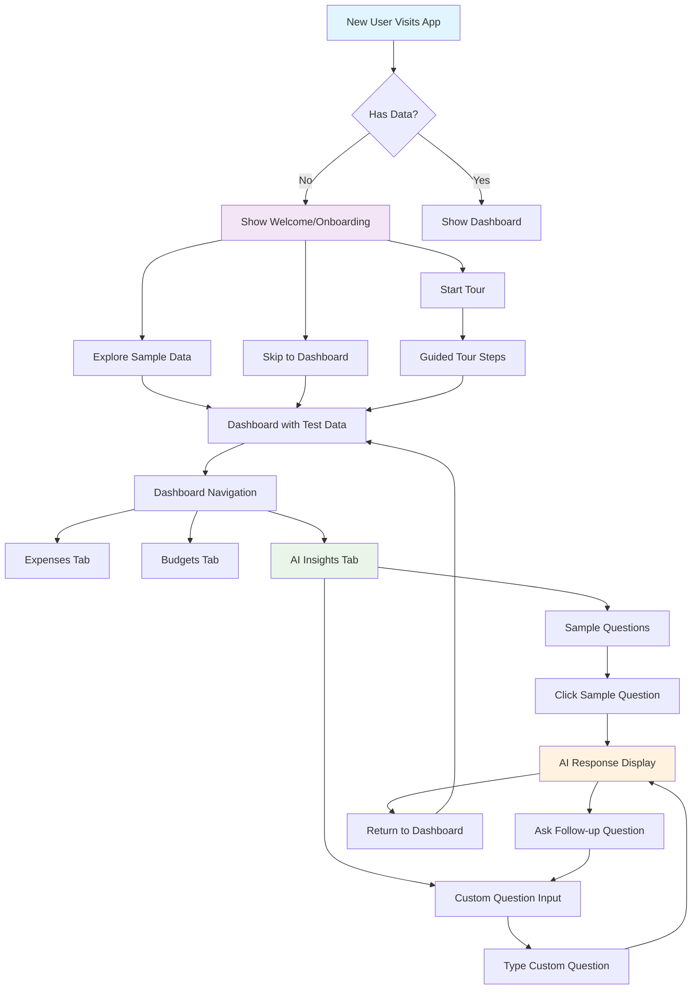
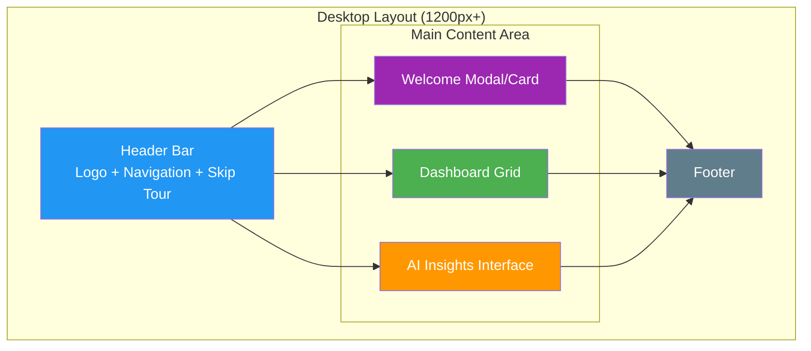
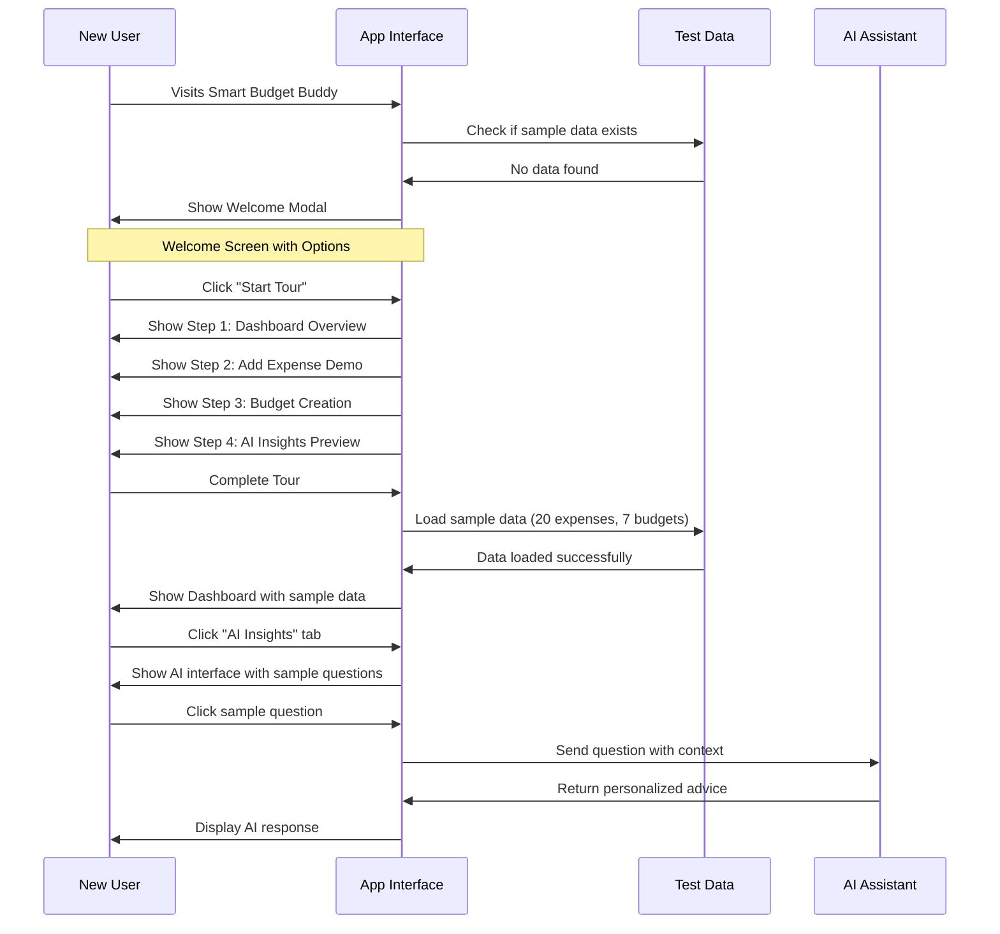
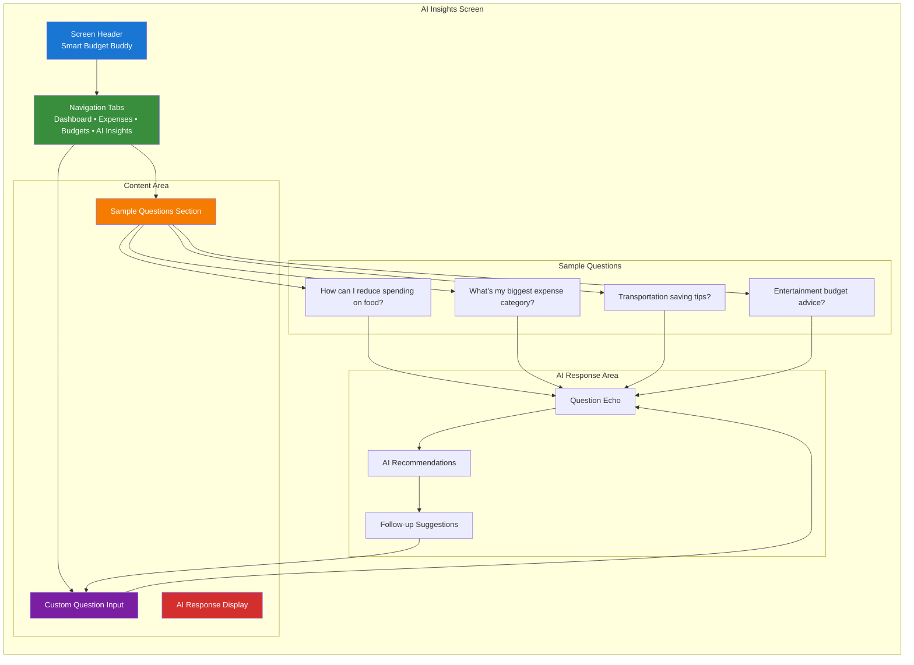
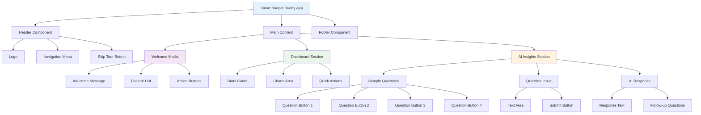
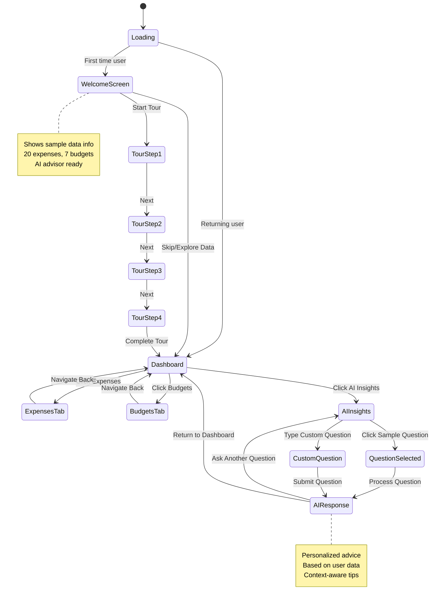
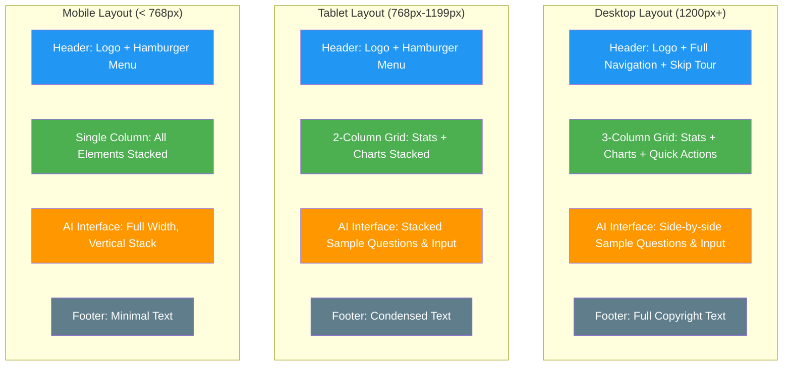
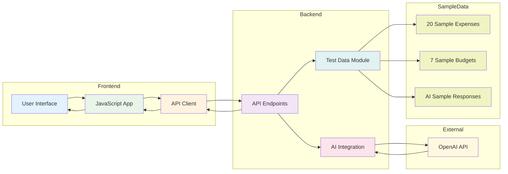

# Smart Budget Buddy - Mermaid Wireframes

## 1. User Flow Diagram

## 2. Screen Layout Diagram

## 3. Onboarding Flow Diagram

## 4. AI Insights Interface Diagram

## 5. Component Hierarchy Diagram

## 6. State Flow Diagram

## 7. Responsive Layout Diagram

## 8. Data Flow Diagram

## Usage Instructions for Excalidraw:

1. **Copy any of these Mermaid diagrams** into Excalidraw
2. **Use the Mermaid plugin** or convert to visual elements
3. **Focus on diagrams 1, 3, and 4** for your main wireframe needs
4. **Customize colors and styling** to match your app's design
5. **Add annotations** for specific UI elements and interactions

## Key Features Highlighted:
- ✅ New user onboarding flow
- ✅ AI advice getting process
- ✅ Sample data integration
- ✅ Interactive UI components
- ✅ Desktop-focused layout
- ✅ Low-fidelity wireframe style
